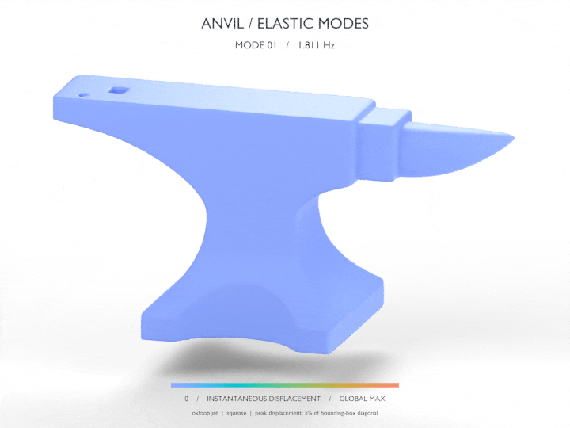
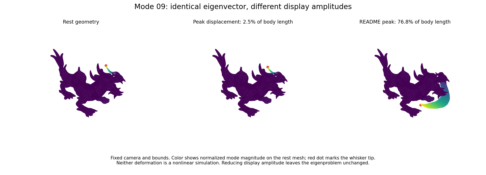

# warpack

Sparse eigenvalue problems computed in **NVIDIA Warp**, with an optional **cuDSS** inverse backend. FP64 arithmetic, device-resident projected eigensolves and residuals, and reusable CUDA graphs. NumPy, SciPy, CuPy, and Spectra are references in the tests and benchmarks; they do not perform eigensolver computation inside the library.

This is a first implementation, not an API-compatible drop-in replacement for Spectra or ARPACK. It covers their main eigenproblem families. Performance varies by problem: the measurements below include cases where Spectra or CuPy wins.

[Download the animated teaser and editable Blender scene](https://github.com/alecjacobson/warpack/releases/tag/v0.1.3) · [Original movie and numerical data](https://github.com/alecjacobson/warpack/releases/tag/v0.1.0)



## Supported problems

| Problem | API | Notes |
|---|---|---|
| Real symmetric | `KrylovSchur` | Thick restart, two-pass reorthogonalization, LM/LA/SA/SM/BE selection |
| Symmetric block inverse iteration | `SymmetricEigensolver` | CholeskyQR2 and Rayleigh–Ritz; supply an iteration operator that amplifies the requested spectrum |
| Symmetric generalized `A x = λ B x` | `GeneralizedEigensolver` | SPD mass, including non-diagonal sparse B; B-orthonormal eigenvectors; inverse iteration and interior targeting |
| Complex Hermitian | `HermitianEigensolver` | Realification, block iteration, and complex basis recovery; avoids duplicate realified eigenvectors |
| Real or complex nonsymmetric | `GeneralEigensolver` | Restarted complex Arnoldi, device Hessenberg reduction and shifted QR; LM/SM/LR/SR/LI/SI selection |
| Real or complex shift-invert | `ShiftInvertEigensolver` | Eigenpairs nearest a real or complex shift, using cuDSS or pure-Warp GMRES |
| Buckling / Cayley | `BucklingEigensolver`, `CayleyEigensolver` | Generalized spectral transforms, with residuals in the original problem |
| Partial rectangular SVD | `PartialSVD` | Largest nonzero real singular triplets through an augmented symmetric operator |
| Pure-Warp SPD inverse | `CGInverse` | Preallocated Warp CG, with device convergence checks |
| Tetrahedral rest elasticity | `RestElasticity` | Stable Neo-Hookean rest Hessian, lumped mass, graph-capturable value assembly |

`SparseOperator` accepts compact scalar FP64 CSR or 3×3 FP64 BSR matrices from `warp.sparse`. Complex CSR values use `wp.vec2d(real, imaginary)`. The general and Hermitian paths are currently reference implementations; their performance has not been tuned to the level of the real symmetric path. The SVD path is validated for leading nonzero singular triplets; recovery of nullspace bases is not currently supported.

## Install

```bash
python -m pip install -e '.[test]'
# Optional sparse direct inverse:
python -m pip install -e '.[cudss]'
# Reference GPU/CPU benchmarks:
python -m pip install -e '.[benchmark]'
```

Tested with Python 3.10, Warp 1.15.0, CUDA driver 570.158.01, cuDSS 0.8.0.10, CuPy 14.2.0, and an NVIDIA L40. Conditional graphs require CUDA driver support for CUDA 12.4 or later. Complex data and all solver workspaces currently use double precision.

## Symmetric solve and graph replay

```python
import warp as wp
from warpack import SparseOperator, KrylovSchur

# A is a compact, square, FP64 warp.sparse.BsrMatrix already on the GPU.
solver = KrylovSchur(SparseOperator(A), k=20, ncv=48, which="LM", tol=1e-10)
graph = solver.capture(max_iterations=100)
wp.capture_launch(graph)

# Device arrays: no implicit readback.
values = solver.eigenvalues       # (k,)
vectors = solver.eigenvectors     # (k, n), eigenvectors are ROWS
errors = solver.residuals
converged = solver.converged      # number of converged requested eigenpairs
iterations = solver.iterations
```

For symmetric solves, the reported residual is `||A x - λ x||₂ / max(1, |λ|)`, with unit-norm vectors. `status == 0` means no internal factorization failure; it does **not** mean all eigenpairs converged. Check `converged == k` and the residuals. A fixed iteration budget can expire without convergence. `SM` targets are generally better addressed with shift-invert than an untransformed Krylov iteration.

`capture()` compiles and warms kernels, allocates setup state, and constructs a reusable graph. Ordinary symmetric and general iterations use a device-controlled conditional loop. cuDSS and the current Warp iterative inverse functors require a **fixed outer graph** because their internal graph operations cannot be nested inside a conditional body. This is selected automatically; `capture(iterations, adaptive=False)` makes it explicit. Fixed outer loops still perform all numerical work on device. There are no hidden host eigensolves or residual readbacks.

Matrix **values** can change between replays with stable array addresses. Changing a sparse topology requires a new operator/solver setup. An inverse's factors must also be updated or recreated when matrix values change. A solver instance owns mutable workspaces and is not thread-safe. Destroy graphs before closing their inverse backend; never replay a graph after its factors have been released.

## Inverse and generalized problems

```python
from warpack import CuDSSInverse, GeneralizedEigensolver

# Kshift is A - sigma*B, assembled on device before factor setup.
sigma = 7.3
inverse = CuDSSInverse(Kshift, width=48, mtype="symmetric")
solver = GeneralizedEigensolver(
    SparseOperator(A), SparseOperator(B), inverse,
    k=20, ncv=48, target=sigma, tol=1e-10,
)
graph = solver.capture(40, adaptive=False)
wp.capture_launch(graph)
```

For a zero shift and SPD A, `which="SA"` selects the lowest modes. For an interior shift, pass the matching `target=sigma`; sorting by smallest algebraic value is not equivalent to sorting by distance to an interior shift. The generalized residual uses `||Ax-λBx||₂ / max(1, ||Ax||₂+|λ| ||Bx||₂)`. Inner iterative inverses need tighter tolerances than the outer eigensolve. Verify the residual in the **original** problem after any spectral transformation; `EigenpairEvaluation` provides this for real standard problems, and `ShiftInvertEigensolver` does so automatically for complex shift-invert.

cuDSS analysis and first factorization are setup operations outside graph capture. cuDSS may use host work during that setup. A retained Warp workspace allocator avoids `cudaMalloc` inside captured cuDSS solves. Its setup also finalizes Warp's exact BSR nonzero count before scalar CSR expansion.

## Anvil showcase

The current README GIF uses the supplied [`anvil for export-ftetwild.mesh`](anvil%20for%20export-ftetwild.mesh), read directly from disk: **94,619 vertices, 508,903 tetrahedra, and 283,857 degrees of freedom**. No mesher is invoked. The longest rest extent is normalized to one metre; the same illustrative material as the dragon is used (`E = 100,000 Pa`, `ν = 0.3`, `ρ = 1,000 kg/m³`), with a free body, stable Neo-Hookean rest Hessian, and lumped mass. Six rigid modes are checked and omitted, then the first 20 elastic modes are shown in order.

Each mode's maximum displacement is **5% of the rest bounding-box diagonal**, checked over **all vertices**, including the interior. The normalized diagonal is 1.18974049 m, so every peak displacement is 0.05948702 m. The smooth, continuous gptoolbox `okloop(256,-4*pi/3,-pi/2)` palette has **no isoline stripes**. Color follows instantaneous displacement with one fixed scale for the entire sequence. Each mode eases from rest to peak and back with `squease`; the camera stays fixed against a white studio background. The GIF has 660 frames at 20 fps, lasting 33 seconds.

The maximum original-problem normalized residual is **2.62e-9**, and the mass-orthogonality error is **1.91e-14**. Frequencies span **1.811–9.166 Hz** under the illustrative material parameters. These are exaggerated linear mode shapes. See the [numerical report](results/anvil_modes.json), [scale and style metadata](results/anvil_teaser.json), and [evaluated scene validation](results/anvil_teaser_validation.json). Historical dragon performance and reference comparisons below still describe the dragon meshes.

Reproduce with Blender 4.5 and [gifski](https://gif.ski/):

```bash
python -m examples.dragon_modes --mesh "anvil for export-ftetwild.mesh" \
  --out results/anvil_modes.npz
blender -b --python examples/render_modes.py -- \
  --input results/anvil_modes.npz --output results/anvil_base.blend \
  --name Anvil --up-axis Y --yaw-degrees 90
blender -b --python examples/render_teaser.py -- \
  --base results/anvil_base.blend --input results/anvil_modes.npz \
  --output results/anvil_teaser.blend --name Anvil --up-axis Y --yaw-degrees 90 \
  --amplitude-bbd 0.05 --frames build/anvil_frames --render
blender -b results/anvil_teaser.blend --python-exit-code 1 --python examples/validate_teaser.py
gifski --fps 20 --quality 85 --width 720 --repeat 0 \
  --output results/anvil_teaser.gif build/anvil_frames/frame_*.png
```

The mesh name, orientation, and displacement cap are rendering options; the eigensolver and Hessian are unchanged. The [`v0.1.3` release](https://github.com/alecjacobson/warpack/releases/tag/v0.1.3) includes the input mesh, modes, editable Blender scene, GIF, and validation metadata. Use `--stripes` only to reproduce the older striped dragon style.

## Dragon validation and earlier showcases

The [v0.1.2 GIF](https://github.com/alecjacobson/warpack/releases/tag/v0.1.2) uses the supplied [`xyzrgb_dragon-720K-ftetwild.mesh`](xyzrgb_dragon-720K-ftetwild.mesh): **24,776 vertices, 93,354 tetrahedra, and 74,328 degrees of freedom**. The tetrahedra are read directly from that file; this project does not invoke a mesher. Despite its filename, this volume mesh has 93,354 tets. No mesh decimation or modal reduction is used in the solve.

The original `dragon-H/dragon.mesh` has **330,206 vertices, 1,187,670 tetrahedra, and 990,618 degrees of freedom**, with **3,881,370 stiffness blocks**. All full-dragon performance measurements below refer to that original, larger mesh. Its animation remains in the [v0.1.1 release](https://github.com/alecjacobson/warpack/releases/tag/v0.1.1).

The reference geometry is normalized to a longest bounding-box extent of one metre. The material is `E = 100,000 Pa`, `ν = 0.3`, and `ρ = 1,000 kg/m³`. The polynomial stable Neo-Hookean energy is

```text
ψ(F) = μ/2 (tr(FᵀF) - 3) + (λ+μ)/2 (det(F) - α)²
α = 1 + μ/(λ+μ)
```

Here λ and μ are the physical Lamé constants. The assembled Hessian is the stress-free tangent at `F=I`, checked independently by finite differences of this energy. Mass is **lumped**, not consistent. The body is free: six rigid modes are checked and omitted from the film. We solve `M⁻¹/² H M⁻¹/²`, using a positive unit shift for the inverse, then recover mass-orthonormal physical displacements. The first elastic frequency is **0.90917 Hz** for fTetWild, versus **0.89756 Hz** for the original mesh.

The v0.1.2 dragon GIF exercises all 20 elastic modes in order, from rest to peak amplitude and back using gptoolbox's `squease` function. Peak poses are scaled independently to fit within a centered box twice the original dimensions, with 5% margin; the entire animation occupies at most **1.95×** the original box dimensions. The camera stays fixed. The exact gptoolbox jet-range palette is `okloop(256,-4*pi/3,-pi/2)`, with Polyscope-style alternating scalar stripes. Color represents **instantaneous displacement norm**, divided by the largest displayed displacement anywhere in the whole sequence; the color scale stays fixed as each mode grows and returns to rest. See the [style/scale metadata](results/dragon_ftetwild_teaser.json) and [evaluated scene validation](results/dragon_ftetwild_teaser_validation.json).

These are exaggerated linear mode shapes, not nonlinear deformation trajectories. At the requested large display amplitudes, some tetrahedra invert on both meshes; this does not indicate an invalid rest mesh or an eigensolver error.

The original v0.1.0 film has a white studio background and displacement-magnitude pseudocolor, normalized separately per mode. Each mode plays one cycle in two seconds, with its physical frequency labelled. The maximum displayed surface displacement is 2.5% of body length. An analytic cubic-volume check over the **entire sinusoidal cycle**, on every tetrahedron in every mode, found no inversions. Display amplitude and playback speed are illustration choices, not a physical forcing amplitude or real-time playback.

```bash
# The original workspace keeps this dataset in a sibling directory.
python examples/dragon_modes.py \
  --mesh ../bbw-comparison/dragon-H/dragon.mesh \
  --method krylov --width 64 --iterations 1

# Blender 4.5 is used for the published scene.
blender -b --python examples/render_modes.py -- --preview --render
python examples/validate_animation.py
```

To reproduce the historical v0.1.2 dragon teaser with Blender 4.5 and [gifski](https://gif.ski/):

```bash
python -m examples.dragon_modes --mesh xyzrgb_dragon-720K-ftetwild.mesh \
  --out results/dragon_ftetwild_modes.npz
blender -b --python examples/render_modes.py -- \
  --input results/dragon_ftetwild_modes.npz --up-axis Z \
  --output results/dragon_ftetwild_base.blend
blender -b --python examples/render_teaser.py -- \
  --base results/dragon_ftetwild_base.blend --input results/dragon_ftetwild_modes.npz \
  --output results/dragon_ftetwild_teaser.blend --up-axis Z --stripes \
  --frames build/ftetwild_frames --render
blender -b results/dragon_ftetwild_teaser.blend --python examples/validate_teaser.py
gifski --fps 20 --quality 85 --width 720 --repeat 0 \
  --output results/dragon_ftetwild_teaser.gif build/ftetwild_frames/frame_*.png
```

The GIF contains 33 frames per mode at 20 fps (33 seconds total), on a white studio background. The editable teaser scene has baked geometry and color-amplitude curves and a packed colormap, so it does not depend on custom Python drivers.

For the original benchmark mesh, download `dragon.mesh.gz` from the [v0.1.0 release](https://github.com/alecjacobson/warpack/releases/tag/v0.1.0) and decompress it to `../bbw-comparison/dragon-H/dragon.mesh`. That release includes the exact input mesh, the mass-normalized numerical results and physical modes, and the editable `.blend` scene. Dataset provenance and licensing are in [THIRD_PARTY_NOTICES](THIRD_PARTY_NOTICES).

## Dragon mesh quality and independent mode verification

Both inputs have one connected component, no orphan vertices, and no zero-volume elements. The new mesh has substantially better element shapes:

| Metric | Original dragon-H | Supplied fTetWild |
|---|---:|---:|
| Minimum dihedral angle | 0.492° | 10.471° |
| Minimum mean-ratio quality (regular tet = 1) | 0.00405 | 0.37176 |
| Median mean-ratio quality | 0.6533 | 0.8277 |
| Worst regular-reference Frobenius condition (regular tet = 1) | 132.19 | 3.68 |
| Tets with mean ratio below 0.1 | 58 | 0 |

The original mesh's 58 lowest-quality tets contribute at most **0.057%** of any of the first 20 elastic modes' strain energy. This argues against those elements causing grossly incorrect low modes. See the [element-quality report](results/mesh_quality.json) and [element-energy and display-Jacobian checks](results/dragon_mesh_physics.json).

For **each mesh**, Warp was compared with CuPy `eigsh`, SciPy ARPACK, and C++ Spectra on the identical mass-normalized matrix, initial vector, 26 requested eigenpairs, and 64-vector subspace. Warp and CuPy share cuDSS factors; ARPACK and Spectra share a separate CPU SuperLU factorization. Spectra uses a reference-only callback to that factorization. This is accuracy validation, not a timing benchmark.

Across both meshes and all three references, the maximum relative elastic eigenvalue difference is **5.88e-12**. All 20 elastic mode shapes have mass-weighted, sign-invariant modal assurance equal to **1 to floating-point roundoff**; the six-dimensional rigid subspaces also coincide to roundoff. The largest original-problem normalized residual is **4.48e-8**, including rigid modes. Raw checks: [original mesh](results/dragon_original_solver_validation.json), [fTetWild](results/dragon_ftetwild_solver_validation.json).

The first 20 frequencies change by **−0.43% to +4.16%** between meshes. The new mesh is much coarser and has slightly different geometry, so this comparison does **not** establish continuum convergence or attribute the frequency changes solely to element quality. We use fTetWild for its better element shapes; the original modes also solve their discrete eigenproblem correctly.

To reproduce, install the reference dependencies and build against the pinned Spectra checkout described below:

```bash
g++ -O3 -DNDEBUG -shared -fPIC -I/usr/include/eigen3 -Ibuild/spectra/include \
  benchmarks/spectra_callback.cpp -o build/spectra_callback.so
OPENBLAS_NUM_THREADS=4 OMP_NUM_THREADS=4 python -m benchmarks.validate_dragon_meshes \
  xyzrgb_dragon-720K-ftetwild.mesh --out results/dragon_ftetwild_solver_validation.json
OPENBLAS_NUM_THREADS=4 OMP_NUM_THREADS=4 python -m benchmarks.validate_dragon_meshes \
  ../bbw-comparison/dragon-H/dragon.mesh --out results/dragon_original_solver_validation.json
OPENBLAS_NUM_THREADS=4 python -m benchmarks.mesh_quality \
  ../bbw-comparison/dragon-H/dragon.mesh xyzrgb_dragon-720K-ftetwild.mesh
# Requires both numerical NPZs and the original/current teaser metadata:
OPENBLAS_NUM_THREADS=4 python -m benchmarks.dragon_mesh_physics
```

### Mode 09: constitutive and mass audit

Mode 09's large whisker motion survives an independent **StVK** assembly and a **consistent-mass** solve. We found no rest-Hessian error. The audit uses face-cross-product shape gradients and Green-strain directional derivatives, independently of the production inverse-reference-matrix/block formula. Both full meshes, including graph-reassembled production stiffness, agree with this reference to **4.0e-16 relative Frobenius error**. Recomputed frequencies differ by at most **7.2e-13 relative**, and all 20 elastic mode shapes agree to roundoff.

At the stress-free rest state, StVK, ordinary log Neo-Hookean, and the implemented polynomial stable Neo-Hookean energy have the same tangent for matching physical Lamé constants:

```text
P(I) = 0
DP(I)[D] = μ (D + Dᵀ) + λ tr(D) I
H_ij = V [ μ (g_i · g_j) I + λ g_i g_jᵀ + μ g_j g_iᵀ ]
```

Here `g_i` is the reference shape-function gradient. The polynomial energy's volumetric coefficient is **λ+μ**, not the physical λ alone. This is the parameter conversion in §3.4 of [Smith, de Goes, and Kim (2018)](https://www.tkim.graphics/NEO/StableNeoHookean2018.pdf). Our formula is the polynomial variant, without the paper's optional regularized origin-barrier term; correctly calibrating that variant also gives the same rest tangent. Changing the energy family therefore does not change these infinitesimal rest modes. Finite-amplitude nonlinear trajectories or modes about a predeformed equilibrium are different problems.

Complex-step checks independently differentiate the energy to obtain stress, then differentiate nodal energy gradients to check every element-Hessian entry. They cover all four energy variants, skewed tets, reversed vertex ordering, and Poisson ratios −0.2, 0.3, and 0.49. A separate exact tetrahedral quadrature check verifies consistent mass and its lumped row sums. **102 tests pass**; see [audit validation](results/elasticity_audit_validation.json), [test source](tests/test_elasticity_reference.py), and [raw full-mesh results](results/elasticity_audit.json).

On fTetWild, switching from lumped to consistent mass changes Mode 09 from **1.42311 to 1.42603 Hz (+0.205%)**, with mode-shape MAC **0.9999946**. Its peak/RMS displacement ratio remains **52.6**. In an explicitly defined region within 0.08 body lengths along mesh edges from the tip, **0.0572% of total mass carries 73.8% of this mode's kinetic energy**. The original mesh shows the same localization (0.0528% of mass, 60.9% of modal kinetic energy). Both meshes have one face-connected tetrahedral component and no faces shared by more than two tets. These findings support a localized vibration of a slender appendage in the discrete elastic model, rather than a constitutive, lumping, or disconnected-element artifact. They do not establish continuum convergence at the appendage.

The v0.1.2 dragon teaser's bounding-box-based display scaling moves this tip by **76.8% of the entire body's length**. A twice-size bounding box is a weak amplitude limit for a thin feature: this is **30.7×** a 2.5%-of-body-length display cap. The figure below changes only the display amplitude of the same verified eigenvector; the large pose should not be interpreted as a nonlinear deformation prediction.



Reproduce after generating both mode archives:

```bash
OPENBLAS_NUM_THREADS=4 OMP_NUM_THREADS=4 python -m benchmarks.audit_elasticity
OPENBLAS_NUM_THREADS=4 python -m pytest -q tests/test_elasticity_reference.py
python -m examples.plot_mode09_audit
```

The alternate StVK and consistent-mass assembly and solves use Warp kernels and cuDSS. Host NumPy/SciPy are used only for explicit audit diagnostics and reference differentiation, not production eigensolver computation.

## Validation and benchmarking

```bash
OPENBLAS_NUM_THREADS=4 python -m pytest -q
python -m pip install ruff
ruff check warpack tests benchmarks examples

git clone https://github.com/yixuan/spectra.git build/spectra
# Pin the revision used for the published comparison:
git -C build/spectra checkout db1d5cc3279752ca7ea3e33da44ba2a85e4e4a95
g++ -O3 -DNDEBUG -I/usr/include/eigen3 -Ibuild/spectra/include \
  benchmarks/spectra.cpp -o build/spectra_bench
OPENBLAS_NUM_THREADS=4 OMP_NUM_THREADS=4 python benchmarks/compare.py
OPENBLAS_NUM_THREADS=4 python benchmarks/cusolver_single.py
OPENBLAS_NUM_THREADS=4 OMP_NUM_THREADS=4 python benchmarks/dragon.py
```

All **89 GPU tests pass** for v0.1.2; the package build, lint, format, mesh hashes, and reference versions are recorded in [mesh-comparison validation](results/mesh_comparison_validation.json). The tests cover rectangular SVD, buckling/Cayley transforms, FP64 fractional shifts, real symmetric and nonsymmetric spectra, complex Hermitian and general spectra, repeated/zero eigenvalues, both spectrum ends, interior real/complex shifts, non-diagonal mass, device convergence limits, graph replay with changed matrix values, FEM energy derivatives, rigid modes, and graph-captured FEM assembly. Additional tests independently compare the incremental projected matrix with `Q A Qᵀ`, exercise captured breakdown recovery and small projected eigenproblems, and inspect pure-Warp graphs for host nodes/transfers. These are representative Spectra-style tests, not a complete port of every upstream test.

## v0.1.1 optimization results

All numerical solver work remains in Warp; cuDSS is used only by the optional sparse inverse. The changes replace contended dot-product atomics with two-stage reductions, fuse norm calculation with reorthogonalization, construct the projected matrix incrementally, run breakdown recovery through device conditionals, rank Ritz values in parallel, and stop projected Jacobi sweeps on device. Cheap sparse products are recomputed after restart when they cost less than rotating cached products. Captured breakdown cases also defer early termination until enough independent chains have been explored to recover repeated eigenvalues.

The current comparison uses the same starting vector for single-vector solvers, restored before **every** trial. CuPy 14.2 aliases its supplied `v0` as a mutable work buffer; each call receives a fresh copy outside the timer. Reusing that buffer produced misleading preliminary timings and is not the protocol used in these reports. Block iteration and LOBPCG use block starts. Original v0.1.0 measurements below used different default starting vectors and are retained as historical results.

Median seconds on the same L40, with three timed trials after warmup:

| Problem | Warp replay | CuPy eigsh | SciPy ARPACK | Spectra |
|---|---:|---:|---:|---:|
| dense_sym_1000 | 0.0394 | 0.0756 | 0.3309 | 0.2383 |
| sparse_sym_10000 | 0.0819 | 0.1608 | 0.3759 | 0.3765 |
| poisson_4096 | 0.0751 | 0.1284 | 0.1782 | 0.0390 |
| heterogeneous_laplacian_125000 | 0.3110 | 0.4485 | 5.0099 | 15.1581 |

Poisson uses cuDSS, with 0.0451 s additional setup; the other three Warp cases use only Warp kernels. Setup/JIT, capture, residuals, spectrum errors, and nonconverged LOBPCG results are in the [full benchmark report](results/optimized_benchmarks.json). The requested tolerances differ between implementations; achieved original-problem residuals are reported rather than assuming tolerance parameters mean the same thing. These results cover four workloads, not a universal performance claim.

The largest pure-Warp case improved from 587 ms to 311 ms (1.89×). Its maximum normalized residual is 4.45e-12. Host enqueue takes 0.14 ms, and graph inspection finds only device kernels, memsets, device-to-device copies, and conditionals: no host callbacks or host/device transfers. Setup synchronization and explicit result readback are outside replay. This is an event/source/graph audit, not a full CUDA API trace.

The remaining GPU costs per representative restart are 1.92 ms for expansion/reorthogonalization, 1.79 ms for the projected eigensolve, 0.027 ms for completing the projected matrix, and 0.51 ms for basis rotation. Further speedups should target the first two. Householder/QL and register-batched Jacobi prototypes were accurate but slower and are not used in production. See the [current profile](results/optimized_profile.json).

For the full dragon, the validated default is now **64 vectors and one cycle**, with 64 cuDSS inverse applications. The [standalone showcase run](results/dragon_optimized.json) takes **0.658 s**, plus 4.052 s factor setup, versus 0.934 s replay originally. Its maximum original-problem normalized residual is 2.03e-08, elastic-mode residual is 5.00e-09, and mass orthogonality error is 1.64e-14. The existing v0.1.0 animation and editable scene remain available above.

The separate [shared-factor comparison](results/dragon_tuning.json) uses five timed trials, identical restored starting vectors, and a 1e-7 original-problem residual threshold. Warp takes 0.657 s; the fastest accepted CuPy setting takes 0.591 s (`ncv=64`, `tol=1e-10`, 64 inverse applications, residual 2.40e-08). The report includes rejected subspace sizes and the CuPy tolerance sweep. This budget is validated for this mesh and material, not prescribed for arbitrary inputs.

A subsequent [dragon timing breakdown](results/dragon_breakdown.json) corrects a timing-boundary mismatch in the 657/591 ms comparison: Warp includes the final original-problem residual check, while CuPy excludes it. Measured separately, **Warp's solve takes 634.5 ms and CuPy's takes 591.6 ms**, a **42.9 ms (7.2%)** gap. Warp's physical validation costs another **22.9 ms**. Instrumented cuDSS totals are essentially equal: **531.2 ms for Warp versus 533.7 ms for CuPy**, with 64 solves each. The remaining work is approximately 103 ms versus 58 ms; these are diagnostic event measurements and include instrumentation overhead. Warp's projected eigensolve costs 4.2 ms and its two basis/product rotations together cost 14.8 ms. The next targets are reducing full-basis orthogonalization passes and avoiding retained-product work after the last cycle. CuPy uses a short Lanczos recurrence followed by one full reorthogonalization pass, whereas Warp currently uses two full passes. Run `python -m benchmarks.dragon_breakdown` to reproduce.

The cuDSS graph still includes backend-owned host-to-device metadata copies and needs a fixed outer iteration budget. In the optimized shared-factor run, the host launch call takes 279 ms, overlapping the 657 ms GPU solve; these times must not be added. No cuDSS metadata rewrite workaround is installed. The pure-Warp graph has no such copies.

All **88 GPU tests pass**, with package build, lint, and formatting checks recorded in [optimization validation](results/optimization_validation.json). Those 88 tests describe the v0.1.1 release; v0.1.2 adds a tetrahedron-quality check. Reproduce after building the Spectra baseline as below:

```bash
OPENBLAS_NUM_THREADS=4 OMP_NUM_THREADS=4 python -m benchmarks.compare --same-start --out results/optimized_benchmarks.json
OPENBLAS_NUM_THREADS=4 OMP_NUM_THREADS=4 python -m benchmarks.audit_profile --same-start --out results/optimized_profile.json
OPENBLAS_NUM_THREADS=4 OMP_NUM_THREADS=4 python -m benchmarks.tune_dragon --same-start
python -m examples.dragon_modes --out results/dragon_optimized.npz
```

### Original v0.1.0 measurements

The following tables preserve the original release measurements. Current results and the stricter shared-start protocol are reported separately below.

Benchmark inputs and requested modes are identical across implementations. The synthetic GPU/SciPy suite uses one warmup and three timed repetitions; Spectra uses three fresh-process timed runs. GPU timings synchronize completion and start with resident input data; library JIT and host-to-device transfers are excluded. Warpack factor setup and warmup/capture costs are reported separately. Spectra timings include factor setup where used; its setup component is also reported. Spectra and SciPy are CPU baselines on an Intel Xeon Platinum 8362; this is a cross-hardware comparison. Full-dragon CPU/CuPy measurements are single runs, while the final warpack dragon solve reports three replay timings. Residuals and spectrum differences accompany timings; nonconverged results are not speedup claims.

Measured times in seconds for 20 eigenpairs (median of three runs):

| Problem | warpack replay | CuPy eigsh | SciPy ARPACK | Spectra |
|---|---:|---:|---:|---:|
| Dense symmetric, 1,000 | **0.0521** | 0.0844 | 0.3285 | 0.2571 |
| Sparse symmetric, 10,000 | **0.1119** | 0.1476 | 0.3703 | 0.3581 |
| Poisson, 4,096 | 0.0762† | 0.1297 | 0.1904 | **0.0377** |
| Heterogeneous Laplacian, 125,000 | 0.5876 | **0.3442** | 5.2547 | 14.9871 |

† Warpack uses cuDSS for this case, with an additional 0.0474 s factor setup. Spectra uses shift-invert and includes 0.0099 s factor setup in its time. The other three warpack cases use only Warp kernels. Warpack's maximum normalized residual across these cases is 4.61×10⁻¹². Its 25.5× speedup over Spectra on the largest case is a GPU-versus-CPU result; CuPy is faster on that case. CuPy LOBPCG took 2.4625 s on Poisson; its 125,000-variable run exhausted the requested accuracy budget, so that time is not treated as a converged comparison.

For the complete dragon, computing six rigid and 20 elastic modes:

| Solver | Factor setup (s) | Solve (s) | Maximum normalized residual |
|---|---:|---:|---:|
| warpack + cuDSS | 4.134 | 0.934 | 4.88×10⁻⁸ |
| CuPy eigsh + cuDSS | 3.993 | **0.642** | 7.05×10⁻⁸ |
| SciPy ARPACK + SuperLU | 215.044 | 70.766 | 4.85×10⁻⁸ |

Warpack's elastic-mode residuals are below 4.66×10⁻⁹ and its mass orthogonality error is 1.89×10⁻¹⁴. The residual maximum above includes the near-zero rigid modes. The current implementation does not outperform every GPU competitor.

On the separate 4,096-variable, **one-eigenpair** workload, cuSOLVERSp took 0.03374 s, CuPy 0.21502 s, and warpack 0.00272 s per replay **plus 0.03454 s setup**. The warpack/cuSOLVER methods use the supplied shift; CuPy uses its native smallest-algebraic iteration. These figures do not imply a first-solve win over cuSOLVERSp.

Raw reports: [synthetic suite](results/benchmarks.json), [dragon](results/dragon_modes.json), [dragon references](results/dragon_comparison.json), [single eigenpair](results/cusolver_single.json), [animation validation](results/animation_validation.json).

The [cuSOLVERSp `csreigvsi` routine](https://docs.nvidia.com/cuda/cusolver/index.html#cusolverSp-t-csreigvsi) computes one eigenpair near a shift and is deprecated. It is therefore benchmarked as a separate one-eigenpair workload, not relabelled as a 20-mode solver. [CuPy `eigsh`](https://docs.cupy.dev/en/stable/reference/generated/cupyx.scipy.sparse.linalg.eigsh.html) and CuPy LOBPCG are additional GPU comparisons. PRIMME/MAGMA GPU variants have not been benchmarked here.


## Pre-optimization performance and synchronization audit

These historical measurements motivated the v0.1.1 changes. The [audit scripts](benchmarks/audit_profile.py) separate host enqueue time from CUDA-event elapsed time and inspect captured graph nodes. This is a source/graph/event audit, **not** a full Nsight CUDA API trace. Nsight Systems was unavailable in the test environment.

The pure-Warp 125,000-variable solve took **587.27 ms on device**, **587.36 ms wall time**, and **0.36 ms to enqueue**. The graph contains only kernels, memsets, device-to-device copies, and a device conditional loop. There are no host callbacks or host/device copies. Explicit setup synchronization and final benchmark completion waits are outside the numerical iteration. The representative restart costs are:

| Stage | GPU time per restart (ms) |
|---|---:|
| Expand basis and reorthogonalize | 3.56 |
| Form projected matrix | 1.34 |
| Solve 48×48 projected eigenproblem | 2.81 |
| Rotate basis and cached operator products | 1.02 |
| Copy results and compute residuals | 0.17 |

These are separate instrumented stage measurements, not an exact decomposition of an entire converged run. The optimization targets identified at that point were a cheaper Warp projected eigensolve, incremental Lanczos/arrowhead projection instead of rebuilding the full Gram matrix, more efficient orthogonalization reductions, and device-conditional breakdown recovery. Ten fixed Jacobi sweeps and thousands of shared-memory barriers are expensive even for a small projected problem. Reducing accuracy alone does not close the gap: Warp at tolerance 1e-10 took 553 ms with a maximum absolute residual of 4.18e-10. The fixed-seed CuPy run at tolerance 1e-9 took 439 ms with residual 9.95e-10. [CuPy 14.2.0's small projected eigensolve](https://github.com/cupy/cupy/blob/v14.2.0/cupyx/scipy/sparse/linalg/_eigen.py#L300) uses CPU NumPy; reproducing that choice would violate this project's device-computation requirement.

**The optional cuDSS path has a separate caveat.** Its dragon graph contains **172 pageable host-to-device metadata copies of 8 bytes each**, two per inverse application. `capture_launch` itself takes about **614 ms**, overlapping a **933 ms** GPU solve. This is blocking host submission, despite no Python-level readback. Replacing those sources with pinned memory or device memory in a diagnostic graph experiment left total solve time essentially unchanged (933–934 ms), and the launch call still took about 600 ms. The copy nodes therefore do not explain the elapsed-time gap by themselves. The experiment is not a production workaround: the metadata belongs to cuDSS internals. A CUDA API timeline is still needed to distinguish driver submission/backpressure from other backend serialization. Host enqueue time must **not** be added to device time because they overlap.

The original dragon run also did avoidable work: **two** 48-vector restart cycles produced a maximum original-problem residual of **2.22e-8 in 0.717 s**, versus 0.933 s for three cycles, reducing inverse applications from 86 to 67. The same-factor CuPy comparison with 64 vectors took 0.591 s with 64 inverse applications and residual 7.18e-8. CuPy with 48 vectors took 0.644 s but had residual 2.58e-7, failing the showcase's 1e-7 threshold. This is evidence for better stopping/locking and equivalent original-problem accuracy checks; it is not a blanket recommendation to use two cycles on other matrices.

The dragon numbers above **include cuDSS**. Eliminating that optional backend as well needs a competitive Warp preconditioner for the inverse/lowest-mode problem; the existing basic CG inverse is not a demonstrated replacement at this scale.

Reproduce after generating the benchmark inputs:

```bash
OPENBLAS_NUM_THREADS=4 OMP_NUM_THREADS=4 python -m benchmarks.audit_profile
OPENBLAS_NUM_THREADS=4 OMP_NUM_THREADS=4 python -m benchmarks.audit_dragon
# Diagnostic graph-copy substitution also requires cuda-bindings:
OPENBLAS_NUM_THREADS=4 OMP_NUM_THREADS=4 python -m benchmarks.audit_cudss_copies
```

Raw follow-up results: [pure Warp](results/audit_profile.json), [shared-factor dragon comparison](results/audit_dragon.json), [cuDSS copy experiment](results/audit_cudss_copies.json). Original release measurements remain unchanged above.
