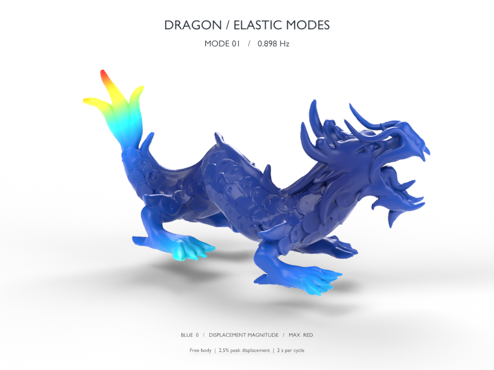

# warpack

Sparse eigenvalue problems computed in **NVIDIA Warp**, with an optional **cuDSS** inverse backend. FP64 arithmetic, device-resident projected eigensolves and residuals, and reusable CUDA graphs. NumPy, SciPy, CuPy, and Spectra are references in the tests and benchmarks; they do not perform eigensolver computation inside the library.

This is a first implementation, not an API-compatible drop-in replacement for Spectra or ARPACK. It covers their main eigenproblem families. Performance varies by problem: the measurements below include cases where Spectra or CuPy wins.

[Watch the dragon's first 20 elastic modes](results/dragon_modes.mp4) · [Download the editable Blender scene and numerical data](https://github.com/alecjacobson/warpack/releases/tag/v0.1.0)



## Supported problems

| Problem | API | Notes |
|---|---|---|
| Real symmetric | `KrylovSchur` | Thick restart, two-pass reorthogonalization, LM/LA/SA/SM/BE selection |
| Symmetric block inverse iteration | `SymmetricEigensolver` | CholeskyQR2 and Rayleigh–Ritz; supply an iteration operator that amplifies the requested spectrum |
| Symmetric generalized `A x = λ B x` | `GeneralizedEigensolver` | SPD mass, including non-diagonal sparse B; B-orthonormal eigenvectors; inverse iteration and interior targeting |
| Complex Hermitian | `HermitianEigensolver` | Realification, block iteration, and complex basis recovery; avoids duplicate realified eigenvectors |
| Real or complex nonsymmetric | `GeneralEigensolver` | Restarted complex Arnoldi, device Hessenberg reduction and shifted QR; LM/SM/LR/SR/LI/SI selection |
| Real or complex shift-invert | `ShiftInvertEigensolver` | Eigenpairs nearest a real or complex shift, using cuDSS or pure-Warp GMRES |
| Buckling / Cayley | `BucklingEigensolver`, `CayleyEigensolver` | Generalized spectral transforms, with residuals in the original problem |
| Partial rectangular SVD | `PartialSVD` | Largest nonzero real singular triplets through an augmented symmetric operator |
| Pure-Warp SPD inverse | `CGInverse` | Preallocated Warp CG, with device convergence checks |
| Tetrahedral rest elasticity | `RestElasticity` | Stable Neo-Hookean rest Hessian, lumped mass, graph-capturable value assembly |

`SparseOperator` accepts compact scalar FP64 CSR or 3×3 FP64 BSR matrices from `warp.sparse`. Complex CSR values use `wp.vec2d(real, imaginary)`. The general and Hermitian paths are currently reference implementations; their performance has not been tuned to the level of the real symmetric path. The SVD path is validated for leading nonzero singular triplets; recovery of nullspace bases is not currently supported.

## Install

```bash
python -m pip install -e '.[test]'
# Optional sparse direct inverse:
python -m pip install -e '.[cudss]'
# Reference GPU/CPU benchmarks:
python -m pip install -e '.[benchmark]'
```

Tested with Python 3.10, Warp 1.15.0, CUDA driver 570.158.01, cuDSS 0.8.0.10, CuPy 14.2.0, and an NVIDIA L40. Conditional graphs require CUDA driver support for CUDA 12.4 or later. Complex data and all solver workspaces currently use double precision.

## Symmetric solve and graph replay

```python
import warp as wp
from warpack import SparseOperator, KrylovSchur

# A is a compact, square, FP64 warp.sparse.BsrMatrix already on the GPU.
solver = KrylovSchur(SparseOperator(A), k=20, ncv=48, which="LM", tol=1e-10)
graph = solver.capture(max_iterations=100)
wp.capture_launch(graph)

# Device arrays: no implicit readback.
values = solver.eigenvalues       # (k,)
vectors = solver.eigenvectors     # (k, n), eigenvectors are ROWS
errors = solver.residuals
converged = solver.converged      # number of converged requested eigenpairs
iterations = solver.iterations
```

For symmetric solves, the reported residual is `||A x - λ x||₂ / max(1, |λ|)`, with unit-norm vectors. `status == 0` means no internal factorization failure; it does **not** mean all eigenpairs converged. Check `converged == k` and the residuals. A fixed iteration budget can expire without convergence. `SM` targets are generally better addressed with shift-invert than an untransformed Krylov iteration.

`capture()` compiles and warms kernels, allocates setup state, and constructs a reusable graph. Ordinary symmetric and general iterations use a device-controlled conditional loop. cuDSS and the current Warp iterative inverse functors require a **fixed outer graph** because their internal graph operations cannot be nested inside a conditional body. This is selected automatically; `capture(iterations, adaptive=False)` makes it explicit. Fixed outer loops still perform all numerical work on device. There are no hidden host eigensolves or residual readbacks.

Matrix **values** can change between replays with stable array addresses. Changing a sparse topology requires a new operator/solver setup. An inverse's factors must also be updated or recreated when matrix values change. A solver instance owns mutable workspaces and is not thread-safe. Destroy graphs before closing their inverse backend; never replay a graph after its factors have been released.

## Inverse and generalized problems

```python
from warpack import CuDSSInverse, GeneralizedEigensolver

# Kshift is A - sigma*B, assembled on device before factor setup.
sigma = 7.3
inverse = CuDSSInverse(Kshift, width=48, mtype="symmetric")
solver = GeneralizedEigensolver(
    SparseOperator(A), SparseOperator(B), inverse,
    k=20, ncv=48, target=sigma, tol=1e-10,
)
graph = solver.capture(40, adaptive=False)
wp.capture_launch(graph)
```

For a zero shift and SPD A, `which="SA"` selects the lowest modes. For an interior shift, pass the matching `target=sigma`; sorting by smallest algebraic value is not equivalent to sorting by distance to an interior shift. The generalized residual uses `||Ax-λBx||₂ / max(1, ||Ax||₂+|λ| ||Bx||₂)`. Inner iterative inverses need tighter tolerances than the outer eigensolve. Verify the residual in the **original** problem after any spectral transformation; `EigenpairEvaluation` provides this for real standard problems, and `ShiftInvertEigensolver` does so automatically for complex shift-invert.

cuDSS analysis and first factorization are setup operations outside graph capture. cuDSS may use host work during that setup. A retained Warp workspace allocator avoids `cudaMalloc` inside captured cuDSS solves. Its setup also finalizes Warp's exact BSR nonzero count before scalar CSR expansion.

## Dragon showcase

The requested `dragon-H/dragon.mesh` contains **330,206 vertices and 1,187,670 tetrahedra**, giving **990,618 degrees of freedom** and **3,881,370 stiffness blocks**. No mesh decimation or modal reduction is used in the solve.

The reference geometry is normalized to a longest bounding-box extent of one metre. The material is `E = 100,000 Pa`, `ν = 0.3`, and `ρ = 1,000 kg/m³`. The polynomial stable Neo-Hookean energy is

```text
ψ(F) = μ/2 (tr(FᵀF) - 3) + (λ+μ)/2 (det(F) - α)²
α = 1 + μ/(λ+μ)
```

Here λ and μ are the physical Lamé constants. The assembled Hessian is the stress-free tangent at `F=I`, checked independently by finite differences of this energy. Mass is **lumped**, not consistent. The body is free: six rigid modes are checked and omitted from the film. We solve `M⁻¹/² H M⁻¹/²`, using a positive unit shift for the inverse, then recover mass-orthonormal physical displacements. The first elastic frequency is approximately **0.898 Hz**.

The film has a white studio background and displacement-magnitude pseudocolor, normalized separately per mode. Each mode plays one cycle in two seconds, with its physical frequency labelled. The maximum displayed surface displacement is 2.5% of body length. An analytic cubic-volume check over the **entire sinusoidal cycle**, on every tetrahedron in every mode, found no inversions. Display amplitude and playback speed are illustration choices, not a physical forcing amplitude or real-time playback.

```bash
# The original workspace keeps this dataset in a sibling directory.
python examples/dragon_modes.py \
  --mesh ../bbw-comparison/dragon-H/dragon.mesh \
  --method krylov --width 48 --iterations 3

# Blender 4.5 is used for the published scene.
blender -b --python examples/render_modes.py -- --preview --render
python examples/validate_animation.py
```

Download `dragon.mesh.gz` from the release and decompress it to the `--mesh` path above. The release includes the exact input mesh, the mass-normalized numerical results and physical modes, and the editable `.blend` scene. Dataset provenance and licensing are in [THIRD_PARTY_NOTICES](THIRD_PARTY_NOTICES).

## Validation and benchmarking

```bash
OPENBLAS_NUM_THREADS=4 python -m pytest -q
python -m pip install ruff
ruff check warpack tests benchmarks examples

git clone https://github.com/yixuan/spectra.git build/spectra
# Pin the revision used for the published comparison:
git -C build/spectra checkout db1d5cc3279752ca7ea3e33da44ba2a85e4e4a95
g++ -O3 -DNDEBUG -I/usr/include/eigen3 -Ibuild/spectra/include \
  benchmarks/spectra.cpp -o build/spectra_bench
OPENBLAS_NUM_THREADS=4 OMP_NUM_THREADS=4 python benchmarks/compare.py
OPENBLAS_NUM_THREADS=4 python benchmarks/cusolver_single.py
OPENBLAS_NUM_THREADS=4 OMP_NUM_THREADS=4 python benchmarks/dragon.py
```

The 43 GPU tests cover rectangular SVD, buckling/Cayley transforms, FP64 fractional shifts, real symmetric and nonsymmetric spectra, complex Hermitian and general spectra, repeated/zero eigenvalues, both spectrum ends, interior real/complex shifts, non-diagonal mass, device convergence limits, graph replay with changed matrix values, FEM energy derivatives, rigid modes, and graph-captured FEM assembly. These are representative Spectra-style tests, not a complete port of every upstream test.

Benchmark inputs and requested modes are identical across implementations. The synthetic GPU/SciPy suite uses one warmup and three timed repetitions; Spectra uses three fresh-process timed runs. GPU timings synchronize completion and start with resident input data; library JIT and host-to-device transfers are excluded. Warpack factor setup and warmup/capture costs are reported separately. Spectra timings include factor setup where used; its setup component is also reported. Spectra and SciPy are CPU baselines on an Intel Xeon Platinum 8362; this is a cross-hardware comparison. Full-dragon CPU/CuPy measurements are single runs, while the final warpack dragon solve reports three replay timings. Residuals and spectrum differences accompany timings; nonconverged results are not speedup claims.

Measured times in seconds for 20 eigenpairs (median of three runs):

| Problem | warpack replay | CuPy eigsh | SciPy ARPACK | Spectra |
|---|---:|---:|---:|---:|
| Dense symmetric, 1,000 | **0.0521** | 0.0844 | 0.3285 | 0.2571 |
| Sparse symmetric, 10,000 | **0.1119** | 0.1476 | 0.3703 | 0.3581 |
| Poisson, 4,096 | 0.0762† | 0.1297 | 0.1904 | **0.0377** |
| Heterogeneous Laplacian, 125,000 | 0.5876 | **0.3442** | 5.2547 | 14.9871 |

† Warpack uses cuDSS for this case, with an additional 0.0474 s factor setup. Spectra uses shift-invert and includes 0.0099 s factor setup in its time. The other three warpack cases use only Warp kernels. Warpack's maximum normalized residual across these cases is 4.61×10⁻¹². Its 25.5× speedup over Spectra on the largest case is a GPU-versus-CPU result; CuPy is faster on that case. CuPy LOBPCG took 2.4625 s on Poisson; its 125,000-variable run exhausted the requested accuracy budget, so that time is not treated as a converged comparison.

For the complete dragon, computing six rigid and 20 elastic modes:

| Solver | Factor setup (s) | Solve (s) | Maximum normalized residual |
|---|---:|---:|---:|
| warpack + cuDSS | 4.134 | 0.934 | 4.88×10⁻⁸ |
| CuPy eigsh + cuDSS | 3.993 | **0.642** | 7.05×10⁻⁸ |
| SciPy ARPACK + SuperLU | 215.044 | 70.766 | 4.85×10⁻⁸ |

Warpack's elastic-mode residuals are below 4.66×10⁻⁹ and its mass orthogonality error is 1.89×10⁻¹⁴. The residual maximum above includes the near-zero rigid modes. The current implementation does not outperform every GPU competitor.

On the separate 4,096-variable, **one-eigenpair** workload, cuSOLVERSp took 0.03374 s, CuPy 0.21502 s, and warpack 0.00272 s per replay **plus 0.03454 s setup**. The warpack/cuSOLVER methods use the supplied shift; CuPy uses its native smallest-algebraic iteration. These figures do not imply a first-solve win over cuSOLVERSp.

Raw reports: [synthetic suite](results/benchmarks.json), [dragon](results/dragon_modes.json), [dragon references](results/dragon_comparison.json), [single eigenpair](results/cusolver_single.json), [animation validation](results/animation_validation.json).

The [cuSOLVERSp `csreigvsi` routine](https://docs.nvidia.com/cuda/cusolver/index.html#cusolverSp-t-csreigvsi) computes one eigenpair near a shift and is deprecated. It is therefore benchmarked as a separate one-eigenpair workload, not relabelled as a 20-mode solver. [CuPy `eigsh`](https://docs.cupy.dev/en/stable/reference/generated/cupyx.scipy.sparse.linalg.eigsh.html) and CuPy LOBPCG are additional GPU comparisons. PRIMME/MAGMA GPU variants have not been benchmarked here.


## Follow-up performance and synchronization audit

The [audit scripts](benchmarks/audit_profile.py) separate host enqueue time from CUDA-event elapsed time and inspect captured graph nodes. This is a source/graph/event audit, **not** a full Nsight CUDA API trace. Nsight Systems was unavailable in the test environment.

The pure-Warp 125,000-variable solve took **587.27 ms on device**, **587.36 ms wall time**, and **0.36 ms to enqueue**. The graph contains only kernels, memsets, device-to-device copies, and a device conditional loop. There are no host callbacks or host/device copies. Explicit setup synchronization and final benchmark completion waits are outside the numerical iteration. The representative restart costs are:

| Stage | GPU time per restart (ms) |
|---|---:|
| Expand basis and reorthogonalize | 3.56 |
| Form projected matrix | 1.34 |
| Solve 48×48 projected eigenproblem | 2.81 |
| Rotate basis and cached operator products | 1.02 |
| Copy results and compute residuals | 0.17 |

These are separate instrumented stage measurements, not an exact decomposition of an entire converged run. The main optimization targets are a cheaper Warp projected eigensolve, incremental Lanczos/arrowhead projection instead of rebuilding the full Gram matrix, more efficient orthogonalization reductions, and device-conditional breakdown recovery. Ten fixed Jacobi sweeps and thousands of shared-memory barriers are expensive even for a small projected problem. Reducing accuracy alone does not close the gap: Warp at tolerance 1e-10 took 553 ms with a maximum absolute residual of 4.18e-10. The fixed-seed CuPy run at tolerance 1e-9 took 439 ms with residual 9.95e-10. [CuPy 14.2.0's small projected eigensolve](https://github.com/cupy/cupy/blob/v14.2.0/cupyx/scipy/sparse/linalg/_eigen.py#L300) uses CPU NumPy; reproducing that choice would violate this project's device-computation requirement.

**The optional cuDSS path has a separate caveat.** Its dragon graph contains **172 pageable host-to-device metadata copies of 8 bytes each**, two per inverse application. `capture_launch` itself takes about **614 ms**, overlapping a **933 ms** GPU solve. This is blocking host submission, despite no Python-level readback. Replacing those sources with pinned memory or device memory in a diagnostic graph experiment left total solve time essentially unchanged (933–934 ms), and the launch call still took about 600 ms. The copy nodes therefore do not explain the elapsed-time gap by themselves. The experiment is not a production workaround: the metadata belongs to cuDSS internals. A CUDA API timeline is still needed to distinguish driver submission/backpressure from other backend serialization. Host enqueue time must **not** be added to device time because they overlap.

The original dragon run also did avoidable work: **two** 48-vector restart cycles produced a maximum original-problem residual of **2.22e-8 in 0.717 s**, versus 0.933 s for three cycles, reducing inverse applications from 86 to 67. The same-factor CuPy comparison with 64 vectors took 0.591 s with 64 inverse applications and residual 7.18e-8. CuPy with 48 vectors took 0.644 s but had residual 2.58e-7, failing the showcase's 1e-7 threshold. This is evidence for better stopping/locking and equivalent original-problem accuracy checks; it is not a blanket recommendation to use two cycles on other matrices.

The dragon numbers above **include cuDSS**. Eliminating that optional backend as well needs a competitive Warp preconditioner for the inverse/lowest-mode problem; the existing basic CG inverse is not a demonstrated replacement at this scale.

Reproduce after generating the benchmark inputs:

```bash
OPENBLAS_NUM_THREADS=4 OMP_NUM_THREADS=4 python -m benchmarks.audit_profile
OPENBLAS_NUM_THREADS=4 OMP_NUM_THREADS=4 python -m benchmarks.audit_dragon
# Diagnostic graph-copy substitution also requires cuda-bindings:
OPENBLAS_NUM_THREADS=4 OMP_NUM_THREADS=4 python -m benchmarks.audit_cudss_copies
```

Raw follow-up results: [pure Warp](results/audit_profile.json), [shared-factor dragon comparison](results/audit_dragon.json), [cuDSS copy experiment](results/audit_cudss_copies.json). Original release measurements remain unchanged above.
